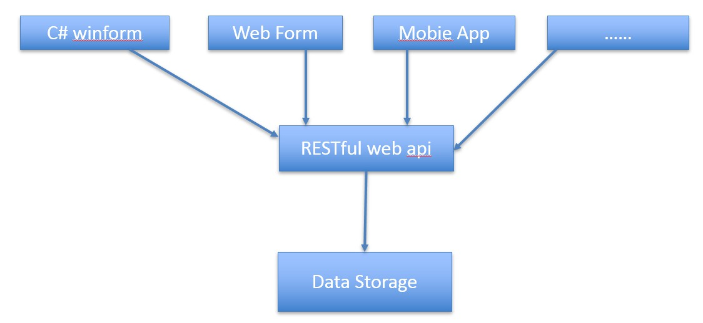
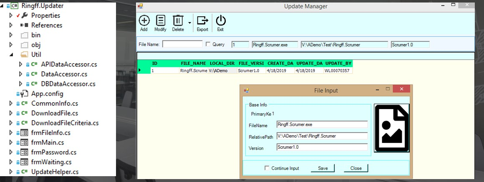
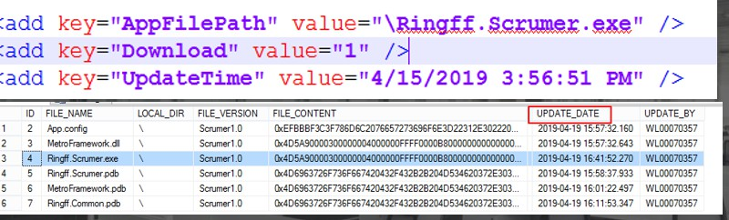
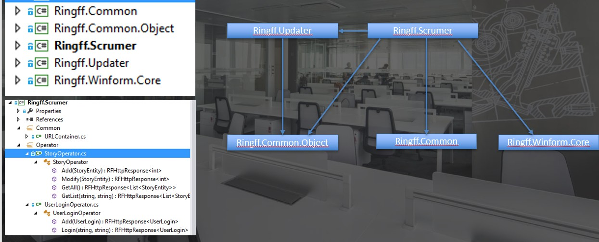
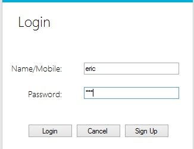
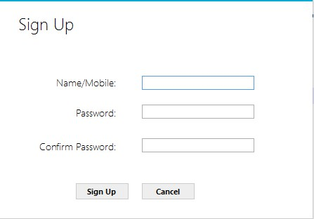
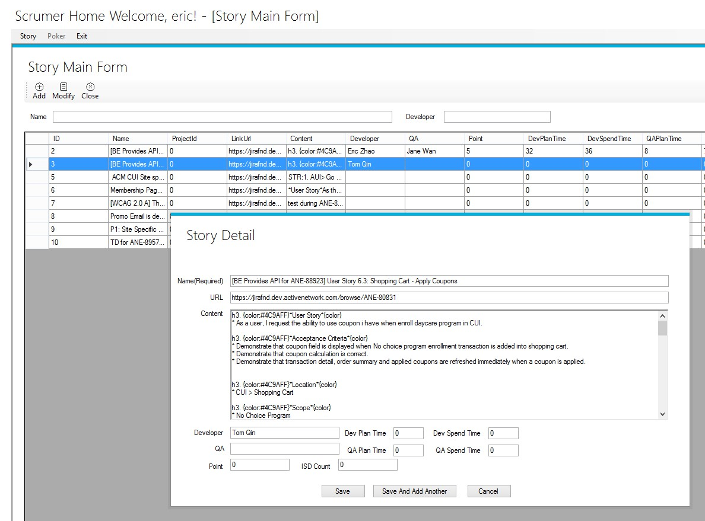
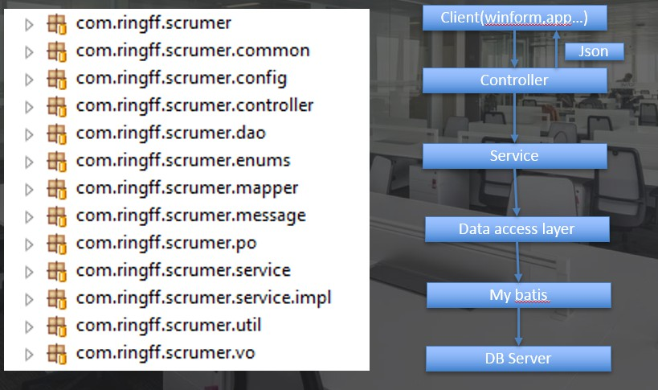

# Practice based on C# Winform Client and Spring boot Web server

## Description

### Why do this

* As I have experience on both JAVA and NET platform. So I have an idea to try to integrate their respective strengths to make software deliver more efficiently.
JAVA platform is the king of web server development, but NET also has its own place. Like c# winform development, I know deeply that how powerful and efficient  using Visual Studio to develop GUI application.

* Another as the front and backend separation become popular, I found the web front become more and more complex and sometimes it even becomes a hell for other developer to maintain it(especially for browser and platform compatibility various issues). I want to try another way to do this.  I design and implement an enterprise pluggable develop prototype to suit for large complex software system.
 
* I believe one viewpoint: If you want to do a product to meet all occasions, you are on the wrong direction. Every product or technology has its bounds and its best usable scenario, we can't use all popular technologies ,  we just use technologies which is best suitable for us(meet our business and usage scenarios).
* As my team name, I believe I can learn more and get more actual practice experiences by doing a project. And this can also verify my ideas (include business or existing technicals).
* Try a challenge to myself, Try to verify this deveopment pattern is whether efficient. The truth is that it deed efficient, once its pattern is established, you can run on the coding way.

## Architecture
First of all, let's see a picture which can introduce the project:

### Auto Updater

* Whole View 

* Config

### Winform Client

* Whole view

### Web API
* Whole view

## Develop specification
* No Compile warning
  * Compile warning means potential bugs, there are many painful lessons in the past , no need to say more.

* DB Specification
  * All db object name should be uppercse.
  * If object name contains more than one word, use underline to concat them.
  * Example: table USER_LOGIN , primary key: PK_USER_LOGIN, index: IDX_USER_LOGIN_Mobile

* Code Specification
** PO : Persistent object.  One table one PO.
** VO: View object, used for client to display or receive client's data. 
The name must ends with VO, and must extends from BaseVO.

* Service: Support service for others. handle core business here.
  * All must have a interface.
  * Name must ends with Service.
  * Interact with PO.

* Controller: Handle request from client. Can interact with service and VO.
  * Name must ends with Controller

* Enum must start with Enum , name format: Enum + TableName + TableColumnName
Example: EnumSystemConfigType

## Difference

* Native app has powerful expressiveness, and it can also be used as lightweight client.
* No various browser issues, consistent experience, more powerful function can implemented by native easily.

## Benefit

* Data , we need collect scrum related data to do deep analysis internal, so scrumer app should follow and collect whole scrum lifetime 
and collect the info. Then analyse it to improve our productivity.
* Make upgrade more easy and maintable.
* A modern development pattern for enterprise level development.
* Can easily integrited with Spring Cloud in the future.
* Resuce develop cost.
* Easy to extend.

## Limitation

* Windows form first for client. Need develop other client for MAC OS / Mobile . But for specific, it's efficient and 

## TODO in the future

* Pluggable win form app.
* Poler with web socket.
* Web client 
* Mobile client.

## Guildline for developer

This project is easy to startup for beginner,you can just follow below step to run it in your local box
* Installl Sql server 2012(or higher version)
* Install Net framework 4.5 or higher version.
* Execute [Initial DB SQL Script](Server/scrumer/src/main/resources/MS_SQL_DB_Initial.sql)
* Start up scrumer web app on Tomcat
* Start Ringff.Updater.exe

## Q&A

* Possible questions

## References

### Resources sites

* [Free gif image makeup online site](https://icons8.com/preloaders/)
* [Icon image materials site](https://fontawesome.com)
* [Online iamge convert site](https://www.online-convert.com/)
* [C# Win form Theme Library,MIT license](https://github.com/AshishKilmist/MetroFramework) 
* [JAVA Mybatis Doc](http://www.mybatis.org/mybatis-3/)

